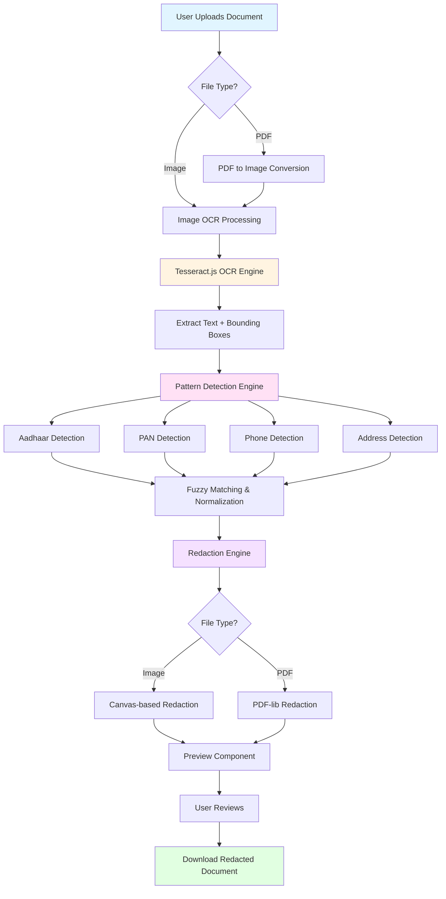

# 🔒 Document Redaction Tool

> **Built for the [Kiro Heroes Challenge - Week 1](https://www.ai4bharat.org/)** 🏆  
> A privacy-first, browser-based tool for automatically redacting sensitive information from documents.

[](https://nextjs.org/)
[](https://www.typescriptlang.org/)
[](https://opensource.org/licenses/MIT)

## 📋 Table of Contents

- [Overview](#overview)
- [Architecture](#architecture)
- [Features](#features)
- [Tech Stack](#tech-stack)
- [Getting Started](#getting-started)
- [How It Works](#how-it-works)
- [Privacy & Security](#privacy--security)
- [Kiro Challenge](#kiro-challenge)
- [License](#license)

## 🎯 Overview

The **Document Redaction Tool** is a single-purpose web application that solves a critical privacy problem: **safely redacting sensitive personal information from documents before sharing them.**

Whether you're sharing documents for job applications, loan processing, or identity verification, this tool automatically detects and permanently redacts:

- 🆔 **Aadhaar Numbers** (12-digit & 16-digit VID)
- 💳 **PAN Numbers** (10-character format)
- 📱 **Phone Numbers** (Indian mobile formats)
- 🏠 **Addresses** (with PIN codes)

**Key Differentiator:** 100% browser-based processing - your documents never leave your device!

## 🏗️ Architecture



### Data Flow

1. **Upload Phase:** User uploads image/PDF via drag-and-drop or file picker
2. **OCR Phase:** Tesseract.js extracts text with precise bounding box coordinates
3. **Detection Phase:** Multi-pass pattern matching identifies sensitive information
4. **Redaction Phase:** Black boxes permanently obscure detected sensitive data
5. **Preview Phase:** User reviews redacted document before download
6. **Download Phase:** Redacted document saved locally

## ✨ Features

### Core Functionality
- ✅ **Multi-format Support:** PNG, JPG, JPEG, PDF (up to 10MB)
- ✅ **Intelligent Detection:** Case-insensitive, fuzzy matching for OCR errors
- ✅ **Multi-page PDFs:** Process documents with multiple pages
- ✅ **Real-time Preview:** See redactions before downloading
- ✅ **Detection Summary:** View count of redacted items by category

### Privacy & Performance
- 🔒 **100% Local Processing:** No server uploads, no cloud APIs
- ⚡ **Fast Processing:** Typical document processed in 5-10 seconds
- 🎨 **Dark Mode UI:** Premium matte black interface
- 📱 **Responsive Design:** Works on desktop and mobile

### Advanced Detection
- 🧠 **OCR Error Correction:** Handles common mistakes (O→0, I→1, S→5)
- 🔍 **Three-pass Detection:** Exact → Fuzzy → Aggressive matching
- 📊 **Confidence Scoring:** Different confidence levels for match quality
- 🚫 **Deduplication:** Prevents multiple redactions of same data

## 🛠️ Tech Stack

| Category | Technology |
|----------|-----------|
| **Framework** | Next.js 14 (App Router) |
| **Language** | TypeScript 5.0 |
| **Styling** | Tailwind CSS |
| **OCR Engine** | Tesseract.js |
| **PDF Processing** | pdf-lib, pdfjs-dist |
| **Image Processing** | HTML5 Canvas API |
| **File Upload** | react-dropzone |
| **Testing** | Vitest, fast-check |
| **State Management** | React useReducer |

## 🚀 Getting Started

### Prerequisites

- Node.js 18+ and npm
- Modern web browser (Chrome, Firefox, Safari, Edge)

### Installation

```bash
# Clone the repository
git clone https://github.com/yourusername/redaction-tool.git
cd redaction-tool

# Install dependencies
npm install
```

### Development

```bash
# Start development server
npm run dev

# Open http://localhost:3000
```

### Testing

```bash
# Run all tests
npm test

# Run tests in watch mode
npm run test:watch

# Run tests with coverage
npm run test:coverage
```

### Production Build

```bash
# Build for production
npm run build

# Start production server
npm start
```

## 🔍 How It Works

### 1. OCR Processing

The tool uses **Tesseract.js** with optimized configuration:
- Character whitelist for document-specific characters
- Preserved inter-word spacing for better accuracy
- Scale factor of 2.0 for PDF rendering (better OCR quality)

### 2. Pattern Detection

**Three-pass detection strategy:**

#### Pass 1: Exact Matching (90% confidence)
- Case-insensitive regex patterns
- Validates format structure

#### Pass 2: Fuzzy Matching (75% confidence)
- OCR error normalization (O→0, I→1, Z→2, S→5, B→8, G→6, T→7)
- Handles common OCR mistakes

#### Pass 3: Aggressive Matching (65% confidence)
- Word-by-word analysis
- Handles watermarks and noise
- Substring extraction and validation

### 3. Redaction Engine

**Image Redaction:**
- Canvas-based black box overlay
- Precise bounding box coordinates
- Exports as PNG

**PDF Redaction:**
- pdf-lib for manipulation
- Page-by-page processing
- Maintains PDF structure

## 🔐 Privacy & Security

### Privacy-First Design

- ✅ **No Server Uploads:** All processing happens in your browser
- ✅ **No Data Collection:** We don't store or track any information
- ✅ **No External APIs:** No third-party services called
- ✅ **Offline Capable:** Works without internet (after initial load)

### Security Considerations

- 🔒 **Permanent Redaction:** Black boxes are part of the image, not overlays
- 🔒 **Client-side Only:** Your documents never leave your device
- 🔒 **No Cookies:** No tracking or session data stored

### Limitations

⚠️ **Image Quality Dependent:** Requires clear, well-lit scans for best results  
⚠️ **OCR Accuracy:** ~85-95% accuracy depending on document quality  
⚠️ **Watermarks:** Heavy watermarking may reduce detection accuracy  
⚠️ **Handwriting:** Limited support for handwritten text

## 🏆 Kiro Challenge

This project was built for the **Kiro Heroes Challenge - Week 1** by AI for Bharat.

### Challenge Theme
**"Build a Single Purpose Website that solves one tiny, annoying problem elegantly"**

### Problem Solved
People need to share identity documents (Aadhaar, PAN) for various purposes but are concerned about privacy. Existing solutions either:
- Require uploading sensitive documents to cloud services
- Are expensive or have usage limits
- Don't work offline
- Lack transparency in processing

### How Kiro Accelerated Development

Kiro's AI-assisted development capabilities helped me:

1. **Rapid Prototyping:** Generated initial component structure in minutes
2. **Pattern Detection Logic:** Helped design robust regex patterns for Indian documents
3. **Error Handling:** Implemented comprehensive error handling and user feedback
4. **Testing Strategy:** Created property-based tests for pattern detection
5. **Code Quality:** Maintained TypeScript best practices throughout

**Development Time:** ~6 hours (would have taken 15-20 hours manually)

### Submission Details

- **GitHub Repository:** [Include your repo link]
- **Blog Post:** [Include AWS Builder Center link]
- **Live Demo:** [Include deployment link if available]

## 📁 Project Structure

```
├── app/
│   ├── globals.css          # Global styles & dark theme
│   ├── layout.tsx           # Root layout
│   └── page.tsx             # Main application page
├── components/
│   ├── ErrorDisplay.tsx     # Error message component
│   ├── PreviewComponent.tsx # Redacted document preview
│   ├── ProgressIndicator.tsx # Processing status
│   └── UploadComponent.tsx  # File upload interface
├── lib/
│   ├── ocrService.ts        # Tesseract.js OCR engine
│   ├── patternDetector.ts   # PII pattern detection
│   ├── redactionEngine.ts   # Redaction logic
│   └── stateReducer.ts      # Application state management
├── types/
│   └── index.ts             # TypeScript definitions
├── utils/
│   ├── downloadHandler.ts   # File download logic
│   ├── imageProcessor.ts    # Image manipulation
│   └── pdfProcessor.ts      # PDF processing
└── tests/
    ├── patternDetector.test.ts
    ├── ocrService.test.ts
    └── redactionEngine.test.ts
```

## 🧪 Testing

The project includes comprehensive tests:

- **Unit Tests:** Core functionality testing
- **Property-based Tests:** Pattern detection validation
- **Integration Tests:** End-to-end workflow testing

```bash
npm test
```

## 🤝 Contributing

Contributions are welcome! Please feel free to submit a Pull Request.

## 📄 License

This project is licensed under the MIT License - see the [LICENSE](LICENSE) file for details.

## 👨‍💻 Author

**Made by Akshay**

Built with ❤️ for the Kiro Heroes Challenge

---

### Acknowledgments

- **AI for Bharat** for organizing the Kiro Heroes Challenge
- **Tesseract.js** for the amazing OCR engine
- **Next.js** team for the excellent framework
- **Kiro AI** for accelerating development

---

**⭐ If you find this project useful, please consider giving it a star on GitHub!**
